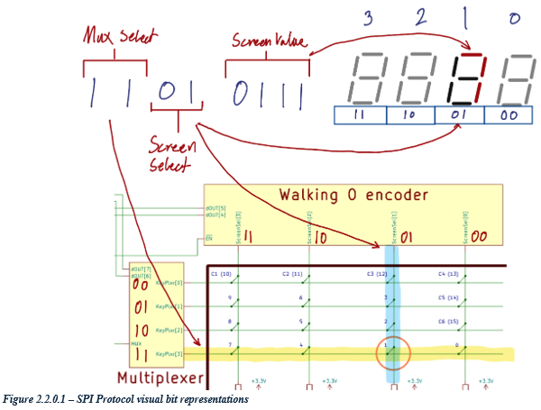
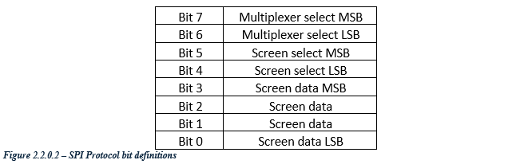
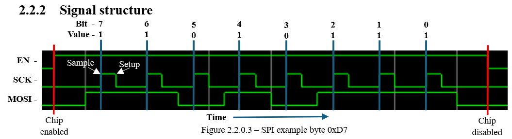
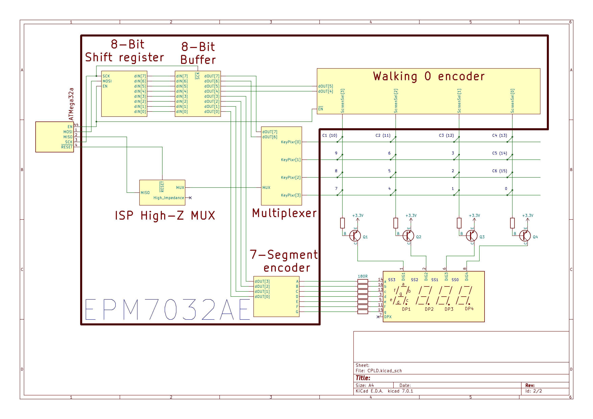
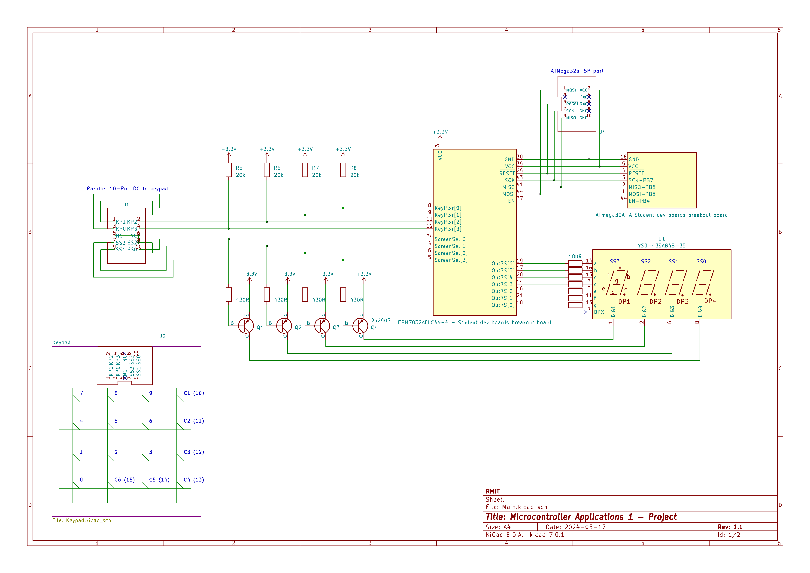
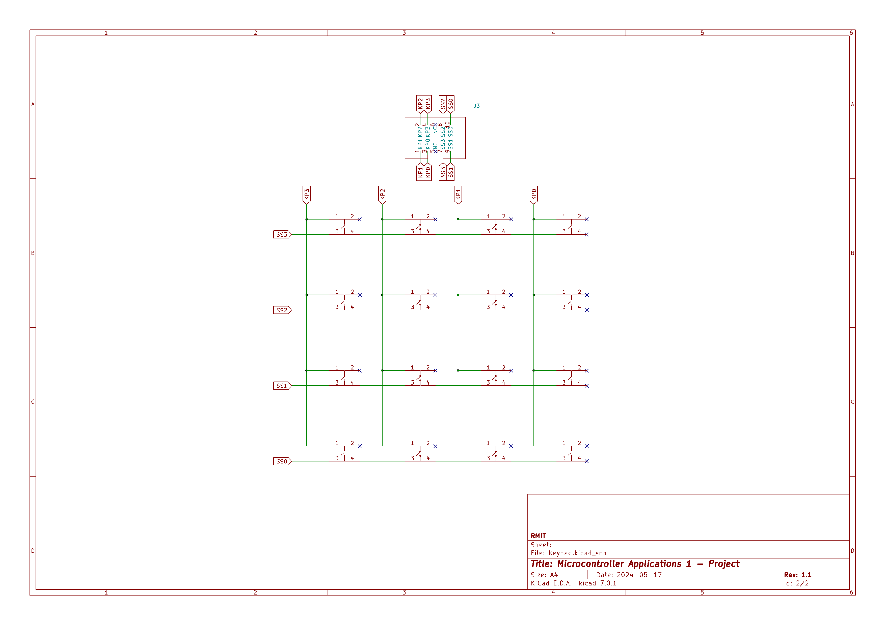

   

# Tiny Tapeout project - 7 segment display driver

- [Read updated documentation](docs/info.md)

<!---

This file is used to generate your project datasheet. Please fill in the information below and delete any unused
sections.

You can also include images in this folder and reference them in the markdown. Each image must be less than
512 kb in size, and the combined size of all images must be less than 1 MB.
-->

## How it works

The serial protocol implemented in this design consists of a simple single byte packet which instructs the CPLD which column of the keypad to multiplex into MISO, which screen should be displaying data, and what number should be displayed on the screen. The screen select signal also doubles up as instructing which row of the keypad to be scanned.
Data is sent Most Significant Bit (MSB) first.

The high impedance programming state is not implemented in this ASIC. It is represented as a bit out instead.
 
Keep in mind: This system is clocked by the SPI clock, and therefore requires constant clocking to function.

## How to test

Build the supporting hardware as described in the schematic found in "Exteral hardware". Create a system which transmits SPI bytes, according to specifications in "How it works". The system will display your desired digits on the selected screens.  
You may also use the MISO to implement a 4x4 keypad, which is interpreted by the system creating the SPI bytes. This will not be detailed as to how to implement.

## External hardware

Main external system schematic:

Simple keypad:

[3D View](https://gds-viewer.tinytapeout.com/?model=https://jac-ee.github.io/tt08-SegDecode-ASIC/tinytapeout.gds.gltf)

